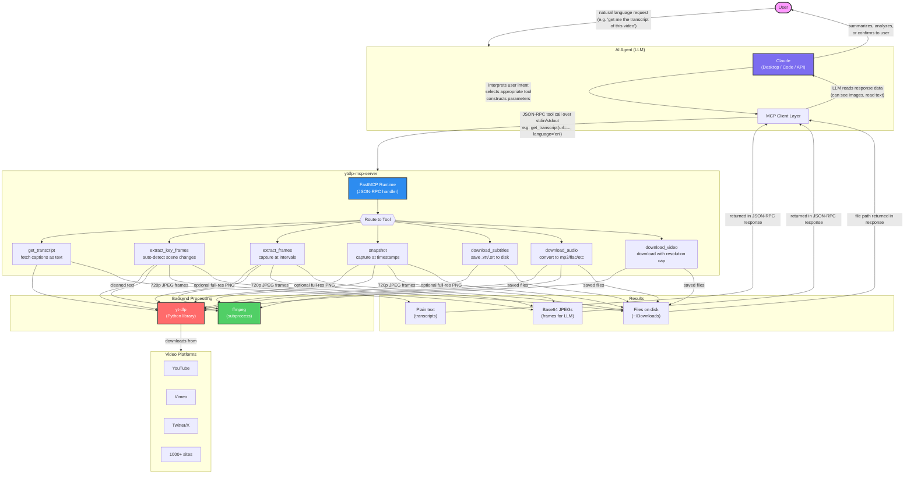
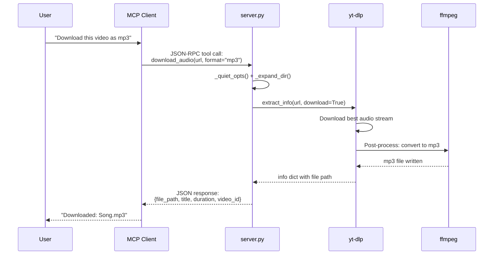
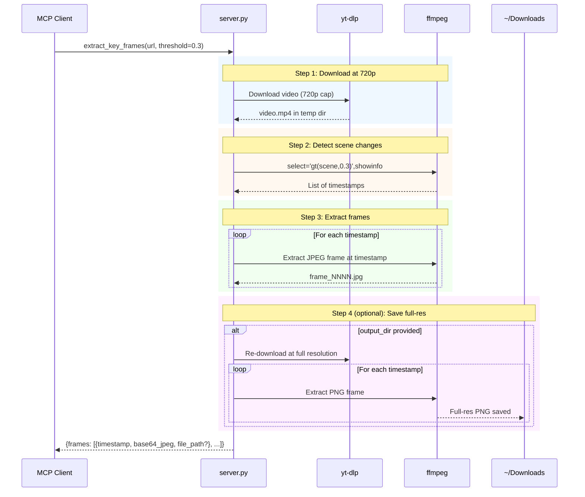
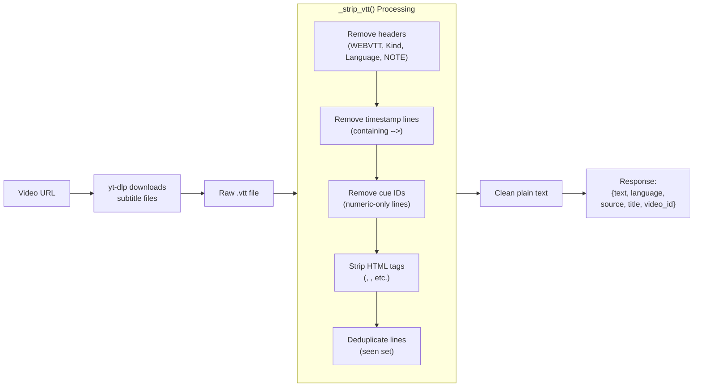

# System Diagram

## How the MCP Server Works

This diagram shows the end-to-end flow: how a user's request travels from the AI agent down through the MCP server to fetch video content and return results.

## Request Lifecycle

## Frame Extraction Pipeline

## Transcript Processing Flow

